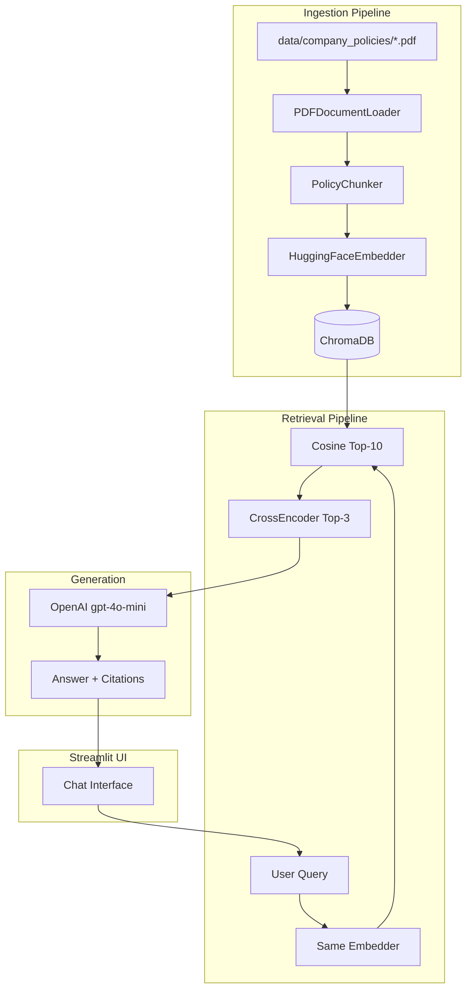
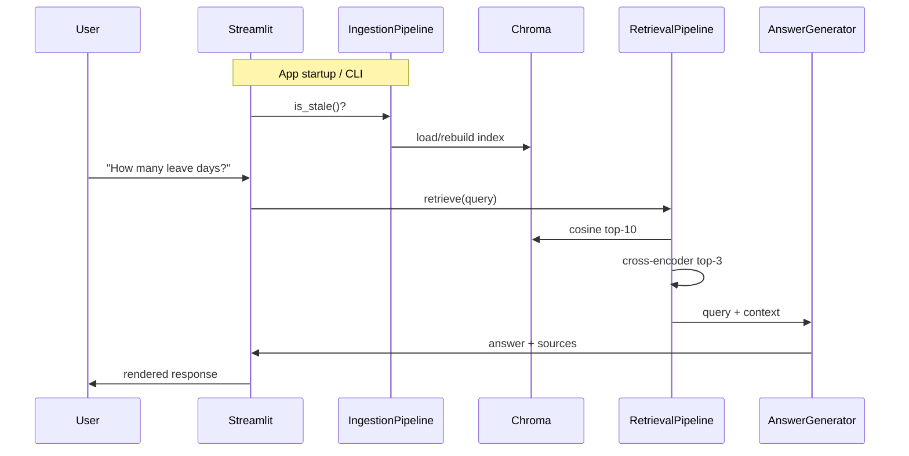

# Employee Policy Assistant

A RAG-powered chatbot that answers questions from company policy PDFs.

## First Iteration

The first iteration delivers a modular Python RAG application: PDF ingestion into ChromaDB with HuggingFace embeddings, two-stage retrieval (cosine top-10 + cross-encoder rerank to top-3), OpenAI answer generation, and a Streamlit chat UI—with both a CLI ingest script and a startup stale-check.

### High-Level Architecture



### End-to-End Data Flow



### Directory Structure

```
emp_policy_assistant/
├── app/
│   └── streamlit_app.py              # Streamlit entry point
├── src/
│   ├── config/
│   │   └── settings.py               # Central config (paths, models, chunk params)
│   ├── ingestion/
│   │   ├── document_loader.py        # PDFDocumentLoader
│   │   ├── chunker.py                # PolicyChunker (2-stage)
│   │   ├── embedder.py               # HuggingFaceEmbedder
│   │   └── pipeline.py               # IngestionPipeline orchestrator
│   ├── vector_store/
│   │   └── chroma_store.py           # ChromaStore wrapper
│   ├── retrieval/
│   │   ├── retriever.py              # VectorRetriever (cosine top-k)
│   │   ├── reranker.py               # CrossEncoderReranker
│   │   └── pipeline.py               # RetrievalPipeline orchestrator
│   ├── generation/
│   │   └── answer_generator.py       # OpenAI RAG answer + citations
│   └── utils/
│       └── ingest_state.py           # PDF fingerprint / ingest manifest
├── scripts/
│   └── ingest.py                     # CLI: python -m scripts.ingest [--force]
├── data/
│   └── company_policies/             # Source PDFs
├── chroma_db/                        # Persisted vector store (generated)
├── .env.example
├── requirements.txt
└── README.md
```

Each module is a **single-responsibility class** with a thin orchestrator (`pipeline.py`) per stage. LangChain is used for document types, loaders, text splitters, and the LLM chain—not as a monolithic black box.

### Module Design

#### Configuration — `src/config/settings.py`

Central `Settings` object via `pydantic-settings`:

| Setting | Default | Purpose |
|---------|---------|---------|
| `PDF_DIR` | `data/company_policies` | PDF source folder |
| `CHROMA_PERSIST_DIR` | `chroma_db` | Vector store path |
| `COLLECTION_NAME` | `company_policies` | Chroma collection |
| `EMBEDDING_MODEL` | `sentence-transformers/all-MiniLM-L6-v2` | Bi-encoder for ingest + query |
| `CROSS_ENCODER_MODEL` | `cross-encoder/ms-marco-MiniLM-L-6-v2` | Reranker |
| `OPENAI_MODEL` | `gpt-4o-mini` | Answer generation |
| `TOP_K_RETRIEVE` | `10` | Initial retrieval |
| `TOP_K_RERANK` | `3` | Final context chunks |
| `CHUNK_MAX_CHARS` | `1000` | Stage-1 max before sentence split |
| `CHUNK_MIN_CHARS` | `500` | Stage-2 minimum sentence chunk |
| `OPENAI_API_KEY` | from `.env` / Streamlit secrets | LLM auth |

#### Ingestion Pipeline

**`PDFDocumentLoader`** — [src/ingestion/document_loader.py](src/ingestion/document_loader.py)

- Scans `PDF_DIR` for `*.pdf` files
- Uses LangChain `PyMuPDFLoader` per file (one document per page)
- Enriches metadata on each document:

```python
{
    "source": "Leave Policy.pdf",
    "source_path": "data/company_policies/Leave Policy.pdf",
    "page": 3,
    "page_label": "4",
    "doc_id": "Leave Policy.pdf::page_3",
}
```

**`PolicyChunker`** — [src/ingestion/chunker.py](src/ingestion/chunker.py)

Two-stage chunking:

- **Stage 1 — Structure-aware recursive split:** `RecursiveCharacterTextSplitter` with separators `["\n\n", "\n", ". ", " ", ""]`, `chunk_size=1000`, `chunk_overlap=100`. Adds `chunk_index`, `chunk_stage` (`"recursive"` or `"sentence"`), and `parent_doc_id` to metadata.
- **Stage 2 — Sentence split for oversized chunks:** Chunks over 1000 characters are re-split with sentence separators `[". ", "? ", "! ", "\n"]`, targeting ~500–1000 characters per sub-chunk.

**`HuggingFaceEmbedder`** — [src/ingestion/embedder.py](src/ingestion/embedder.py)

- Wraps `langchain_huggingface.HuggingFaceEmbeddings` (sentence-transformers)
- Exposes `embed_documents()` and `embed_query()` using the same model for ingestion and retrieval

**`ChromaStore`** — [src/vector_store/chroma_store.py](src/vector_store/chroma_store.py)

- Wraps `langchain_chroma.Chroma` with cosine similarity (`hnsw:space: cosine`)
- Supports `add_documents`, `similarity_search_by_vector`, `delete_collection`, and `get_collection_count`

**`IngestionPipeline`** — [src/ingestion/pipeline.py](src/ingestion/pipeline.py)

Orchestrates `load → chunk → embed → persist`. Returns `{files_processed, pages_loaded, chunks_created, chunks_stored}`.

**`IngestState`** — [src/utils/ingest_state.py](src/utils/ingest_state.py)

- Writes manifest to `chroma_db/ingest_manifest.json` (PDF fingerprints, model names, chunk config)
- CLI via `scripts/ingest.py`; Streamlit auto-runs ingest when the index is stale

#### Retrieval Pipeline

**`VectorRetriever`** — [src/retrieval/retriever.py](src/retrieval/retriever.py)

- Embeds the query with the shared bi-encoder
- Returns top-10 candidates via cosine similarity from ChromaDB

**`CrossEncoderReranker`** — [src/retrieval/reranker.py](src/retrieval/reranker.py)

- Scores all 10 `(query, chunk_text)` pairs with `sentence_transformers.CrossEncoder`
- Returns top-3 with `rerank_score` attached to metadata

**`RetrievalPipeline`** — [src/retrieval/pipeline.py](src/retrieval/pipeline.py)

Combines vector retrieval and cross-encoder reranking into a single `retrieve(query)` call.

#### Answer Generation — [src/generation/answer_generator.py](src/generation/answer_generator.py)

- LangChain `ChatOpenAI` with citation-aware prompting
- Answers only from provided policy excerpts; cites source file and page
- Returns `AnswerResult` with `answer` and `sources` (source, page, rerank_score, excerpt)

#### Streamlit UI — [app/streamlit_app.py](app/streamlit_app.py)

- Sidebar: index status, chunk count, rebuild button, model info
- Main: chat history with expandable source citations
- Cached pipelines via `@st.cache_resource`
- Startup: validates API key, auto-ingests if stale

### Design Decisions

| Decision | Choice |
|----------|--------|
| LLM | OpenAI API (`gpt-4o-mini`) |
| Ingest trigger | CLI script **and** startup stale-check |
| Embedding | HuggingFace `sentence-transformers/all-MiniLM-L6-v2` (local, free) |
| Reranker | Cross-encoder `ms-marco-MiniLM-L-6-v2` |
| Vector DB | ChromaDB persistent local store |
| PDF loader | LangChain `PyMuPDFLoader` |

### Dependencies

Core packages in [requirements.txt](requirements.txt):

- `streamlit`
- `langchain`, `langchain-community`, `langchain-openai`, `langchain-chroma`, `langchain-huggingface`
- `chromadb`
- `sentence-transformers`, `torch`
- `pymupdf`
- `pydantic-settings`, `python-dotenv`

### Planned Future Extensions

- Metadata filtering in retrieval (e.g. by policy document)
- Hybrid search (BM25 + dense)
- Conversation memory / follow-up questions
- Admin UI to upload new PDFs
- Evaluation harness (retrieval hit rate on sample Q&A)
- Swap OpenAI for Ollama via a pluggable LLM interface

---

## Setup

1. Create and activate a virtual environment:

```bash
python -m venv .venv
source .venv/bin/activate
```

2. Install dependencies:

```bash
pip install -r requirements.txt
```

3. Configure your OpenAI API key:

```bash
cp .env.example .env
# Edit .env and set OPENAI_API_KEY
```

Alternatively, set `OPENAI_API_KEY` in `.streamlit/secrets.toml` for Streamlit.

> **Note:** Always activate `.venv` before running commands. Using the system `python` without the venv will cause missing dependency errors (e.g. `pydantic`).

## Ingest Policy PDFs

Place PDF files in `data/company_policies/`, then run:

```bash
python -m scripts.ingest
```

Force a full rebuild:

```bash
python -m scripts.ingest --force
```

The ingest manifest at `chroma_db/ingest_manifest.json` tracks PDF fingerprints and chunk settings. Ingestion re-runs automatically when PDFs or settings change.

## Run the Chat App

```bash
streamlit run app/streamlit_app.py
```

On startup, the app checks whether the index is stale and rebuilds it if needed. Use the sidebar **Rebuild index** button to force a refresh.

## Configuration

Key settings in `src/config/settings.py` are overridable via environment variables. See the configuration table in the **First Iteration** section above.

Secrets are loaded from `.env` (via `python-dotenv`) or `.streamlit/secrets.toml`. The `chroma_db/` directory and `.env` are gitignored.

## License

MIT — see [LICENSE](LICENSE).
